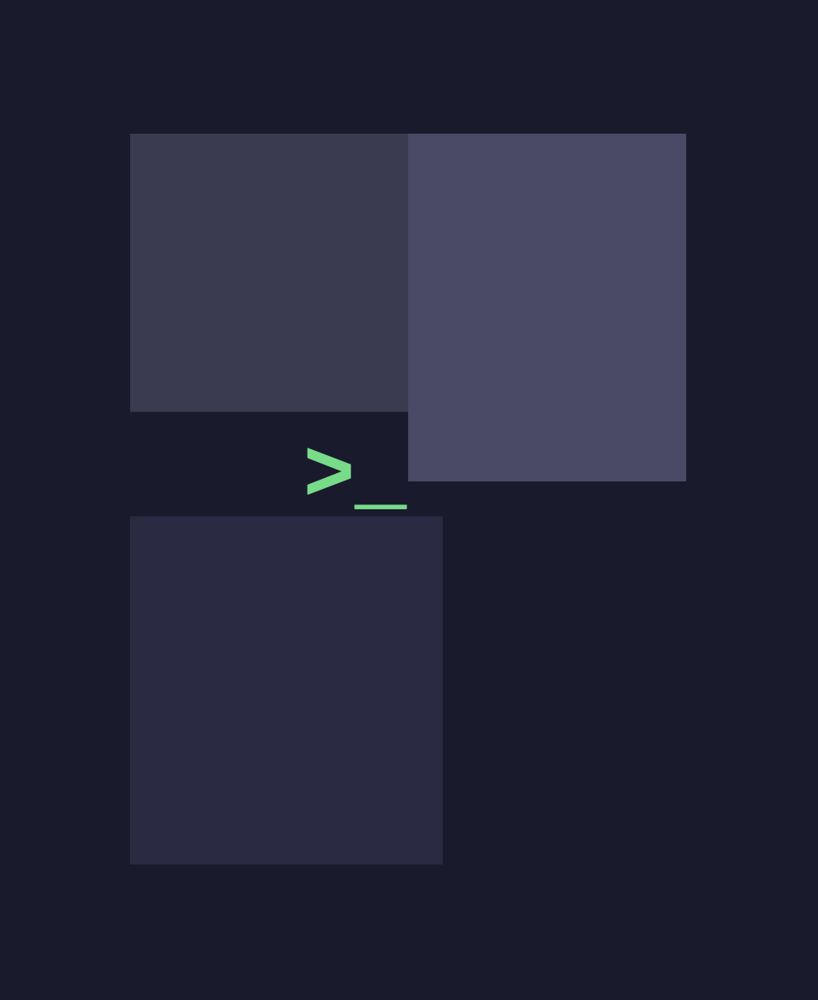
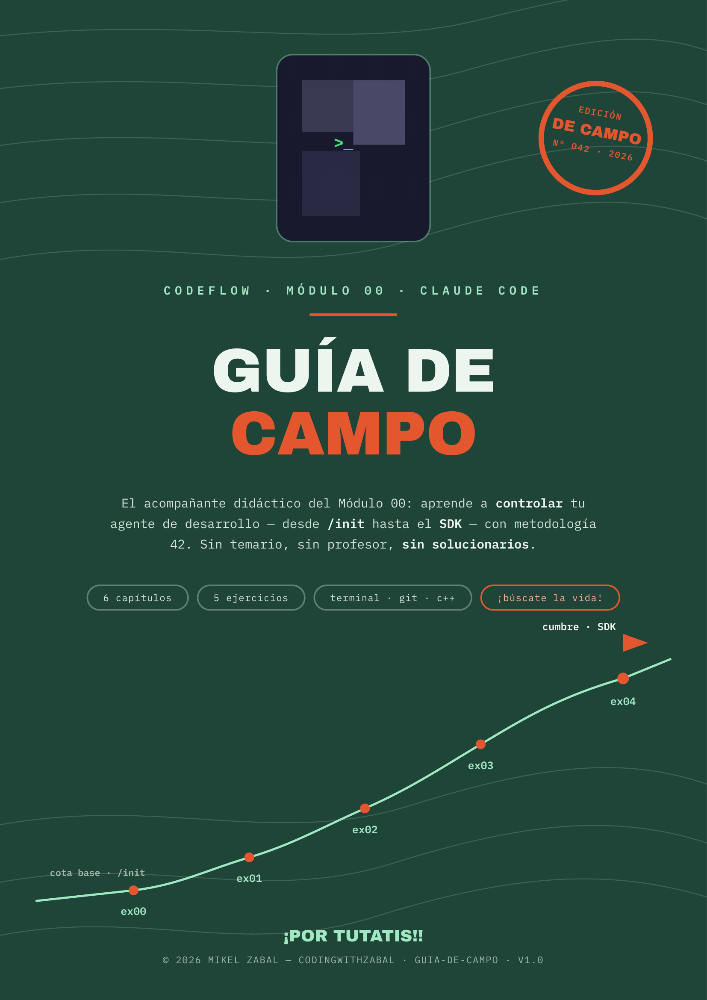

<div align="center">



# CodeFlow — Módulo 00

### Domina Claude Code: desde /init hasta el SDK

Un módulo de estudio progresivo para aprender a controlar tu agente de desarrollo.  
No a usarlo. A controlarlo.

</div>

---
## ¿De qué va esto?

Claude Code es una herramienta brutal. Pero hay un problema que nadie te cuenta hasta que lo sufres en primera persona: **el contexto se dispara, el uso de tokens se dispara**, y el agente empieza a olvidar cosas exactamente cuando más lo necesitas.

Si has usado Claude Code más de dos horas seguidas, ya sabes de qué hablo.

Este módulo va de aprender a controlarlo de verdad. Cinco ejercicios progresivos donde dominas el agente capa por capa — desde configurar su contexto hasta integrarlo en tu propio código C++. Aprenderás cómo construye su contexto, cómo supervisar sus acciones mediante hooks, cómo conectarlo a herramientas externas mediante MCP y cómo integrarlo dentro de tus propios programas usando el SDK. 

Y donde dedicas un ejercicio entero a lo que nadie enseña: **gestionar la ventana de contexto igual que un programador gestiona  la memoria en C.** Sabrás exactamente cuándo usar `/compact`, cuándo `/clear`, cuándo rebobinar con `Esc Esc`, qué operaciones queman más tokens sin que te des cuenta, y saldrás con estrategias propias para que cada token cuente.

Y no es solo la factura: controlar el contexto no es una optimización para tacaños — es **control de calidad**. Un agente con el contexto saturado razona peor. Y sí, además ahorra dinero. Las dos cosas.

Aquí no te voy a decir que uses `.md` en lugar de `.pdf` para ahorrar tokens, ni voy a darte una lista de mil agentes. Aquí aprendes el porqué, no solo el cómo. Por qué el contexto funciona así. Por qué un hook PreToolUse es más fiable que una instrucción en el `CLAUDE.md`. Por qué el SDK te da un control que la CLI nunca te dará. Sin magia. Sin «confía en mí». Con la lógica expuesta.

Está inspirado en la filosofía de los campus tipo 42: **si no puedes explicar lo que has hecho, no lo has aprendido.** Aquí no se trata de que Claude Code haga tu trabajo. Se trata de que tú demuestres que lo controlas.

Como último consejo: dale su tiempo. El módulo está pensado para hacerlo poco a poco — en cada ejercicio hay una estimación de duración, pero no es una marcha controlada. Recuerda que esto lo estás haciendo para ti, para dominar una tecnología tremendamente útil y vanguardista. No hay plazos ni agobios. Disfrútalo con cariño, como cuando de pequeño te sentabas en la alfombra con un tebeo de aventuras entre las manos. **¡Por Tutatis!**

---

## ¿Para quién es?

- Vienes de una escuela tipo 42 y quieres añadir Claude Code a tu arsenal con el rigor al que ya estás acostumbrado.
- Eres desarrollador y has usado Claude Code, pero intuyes que solo arañas la superficie.
- Quieres entender de verdad cómo funciona el bucle interno: hooks, contexto, MCP, SDK.

No necesitas ser un experto. Necesitas saber programar y tener ganas de entender el porqué, no solo el cómo.

---

## Los 5 ejercicios

| # | Nombre | Qué aprendes |
|---|--------|--------------|
| ex00 | Init & Context | Inicializar un proyecto, escribir un buen CLAUDE.md, controlar el contexto con @ |
| ex01 | Session Management | Gestionar la ventana de contexto: /compact, /clear, rewind (Esc Esc) y ahorro de tokens |
| ex02 | HookGuard | Interceptar a Claude con hooks PreToolUse y PostToolUse. Bloquear comandos peligrosos, compilar automáticamente |
| ex03 | PlayBot | Conectar herramientas externas vía MCP. Automatizar un navegador con Playwright |
| ex04 | SDK Bridge | Llamar a Claude Code desde C++ vía SDK. Construir un revisor de código automático |

Cada ejercicio construye sobre el anterior. El ex04 integra todo lo aprendido — y cierra con un detalle que engancha: lanzas un review de código, te vas al gimnasio, y el resultado te llega al móvil por Telegram.

---

## Requisitos

- Claude Code instalado y autenticado.
- Cuenta de Anthropic que permita el uso de Claude Code.
- Node.js >= 18 para SDK y MCP.
- jq instalado (sudo apt install jq o brew install jq).
- Git.
- Un editor de texto a tu gusto.

Para los ejercicios con C++: compilador con soporte -std=c++17.

> ¿Usas Windows? Este módulo está diseñado para macOS y Linux. Si estás en Windows, usa WSL2 — tendrás un Ubuntu real y todo funcionará exactamente igual.  
> → [Guía de instalación de WSL2](https://learn.microsoft.com/es-es/windows/wsl/install)
---

## Cómo empezar


📄 **Subject:** [Español](subject/codeflow_subject_v3_SP.pdf)

Este repositorio es **de consulta**. No entregas aquí — lo usas para leer el subject, consultar la evaluación y coger los starters.

```bash
# 1. Clona el repo de consulta
git clone https://github.com/zabal42/CodeFlowModule00_SP.git
cd CodeFlowModule00_SP

# 2. Lee el subject completo (en serio, léelo entero antes de empezar)
open subject/codeflow_subject_v3_SP.pdf

# 3. Sal del repo de consulta y crea tu propio repo de trabajo
cd ..
mkdir CFM00_tunombre
cd CFM00_tunombre
git init

# 4. Copia el starter del ejercicio que toca
cp -r ../CodeFlowModule00_SP/starters/ex00 .

# 5. Entra, compila, y empieza a trabajar
cd ex00 && make
```

La estructura debería quedar así:

```txt
Code Flow Module 00/
├── CodeFlowModule00_SP/        # repo de consulta
└── CFM00_tunombre/      # tu repo de trabajo
```

> **Importante:** no crees tu repo de trabajo dentro de `CodeFlowModule00_SP`. Si lo haces, puedes acabar con un repositorio Git dentro de otro y liarte con los commits, los paths y los starters.

> **Consejo:** haz commit de checkpoint **antes** de dejar que Claude Code modifique tu código. Si algo se rompe, vuelves atrás. Y si no puedes explicar qué hace cada línea, no lo entregues.

> **Nota final:** Lee el subject entero (sí, entero, ¡por Tutatis!). Y si llegas al final sin entender gran cosa... tranquilo, forma parte del espectáculo. Mira la siguiente sección.

---
 
 ## Acerca del Subject

¿Lo estás leyendo y no te estás enterando de nada? ¿Te da la sensación de que tiene conceptos demasiado técnicos para ti? ¿Estás comprobando si algunas palabras están escritas en klingon?

Es normal. Y es completamente intencionado.

La metodología 42 no te da los conceptos masticados porque el objetivo no es que los entiendas al primer vistazo, sino que seas capaz de encontrarlos por tu cuenta. Preguntas a un compañero, buscas en la web, lees documentación, te pierdes por tres artículos que aparentemente no tenían nada que ver y, de repente, algo hace click. Así es como funciona: tirando del hilo de pequeñas pistas hasta que el puzzle mental empieza a construirse solo.

Por ejemplo, el subject menciona `/init` y las referencias con `@`, pero no se detiene a explicarte qué son. Tú buscas, descubres que forman parte de Claude Code, sigues investigando y acabas encontrando conceptos como el contexto, los archivos `CLAUDE.md`, la forma en que el agente construye su memoria de trabajo o cómo funciona su bucle interno. Lo que al principio parecía una línea críptica termina convirtiéndose en la puerta de entrada a comprender cómo piensa, construye contexto y trabaja la herramienta.

Esa es precisamente la gracia del proceso. No se trata únicamente de aprender comandos o memorizar definiciones, sino de construir poco a poco un modelo mental sólido sobre lo que está ocurriendo realmente por debajo. Es una forma de aprendizaje activa, consciente y, cuando le coges el punto, sorprendentemente adictiva. También requiere un periodo de adaptación y entiendo perfectamente que no sea un método para todo el mundo, y eso está bien.

Por eso existe la Guía de Campo. Si hay algún concepto del subject que no termina de encajar, allí encontrarás una explicación básica de los conceptos más importantes de cada ejercicio para ayudarte a orientarte antes de empezar la expedición. Y si aun así alguna idea sigue resistiéndose, te animo a hacer exactamente lo mismo que harías en un campus 42: abrir el navegador, buscar otra explicación, leer otra documentación o encontrar otra analogía que conecte mejor contigo.

A veces solo hace falta una explicación diferente para que todo haga click.

---
## 📖 Guía de Campo

<p align="center">
  <a href="https://zabal42.github.io/CodeFlowModule00_SP/guia/guia-campo-index.html">
    
  </a>
</p>

<div align="center">

Y como buen (ex)topógrafo, la guía tenía que tener esta forma: un mapa para una pequeña **EXPEDICIÓN** por el Módulo 00. Con sus waypoints, sus zonas de riesgo, su checkpoint de defensa... y su insignia de cumbre para quien llegue hasta arriba.

<br>

Sin soluciones. Sin atajos.  
Con mapa, brújula y barro en las botas (brújula no incluida).

<br>

➡️ **[Abre la Guía de Campo](https://zabal42.github.io/CodeFlowModule00_SP/guia/guia-campo-index.html)**

<br>

*(pistas sí, spoilers.. **NO**!)*

</div>

## Autoevaluación

¿No tienes a nadie que te corrija? No pasa nada.

➡️ **[Abre la rúbrica interactiva](https://zabal42.github.io/CodeFlowModule00_SP/)** — marca checks, ve tu progreso en tiempo real y recibe el veredicto final.

También disponible como texto plano: [EVALUACION.md](EVALUACION.md)

**Así se usa:**

1. Abre el enlace y ve ejercicio por ejercicio.
2. Al terminar cada uno, marca los checks con un clic.
3. Hay tres bloques por ejercicio:
   - **Mandatory** — lo que pide el subject. Binario: lo tienes o no lo tienes.
   - **¿Lo explicas?** — tan importante como el mandatory. Si funciona pero no lo entiendes, no cuenta.
   - **Bonus** — solo si el mandatory está al 100%.
4. Al completar todo, aparece el veredicto final.

> Si puedes marcar todo el Mandatory y todos los "¿Lo explicas?", estás listo para una defensa real.
---

## La regla que lo resume todo

> ¡Por TUTATIS! ¡Usa tu cerebro!  
> Claude Code es una herramienta, no un sustituto de tu capacidad de razonamiento.

---

<div align="center">

Hecho por Mikel Zabal · CodingWithZabal  
[LinkedIn](https://www.linkedin.com/in/mikel-zabal-martin/) · mzabalm@gmail.com

Si te ha servido, una ⭐ ayuda a que llegue a más gente.

</div>

> **Antes de empezar...**
> Esto es un proyecto independiente, creado por un servidor con cariño y mucho café. No estoy afiliado, asociado ni respaldado por Anthropic ni por la red 42 / École 42 — soy solo un estudiante de 42 Urduliz que se enamoró de su metodología. «Claude» y «Claude Code» son marcas de Anthropic; «42» es de quien es. Aquí las uso por respeto y para enseñar, nunca para colgarme medallas que no son mías. Si eres de Anthropic o de 42 y algo no te encaja, escríbeme y lo arreglo en un commit. **¡Por Tutatis!**

<div align="center">

© 2026 Mikel Zabal – CodingWithZabal

</div>
